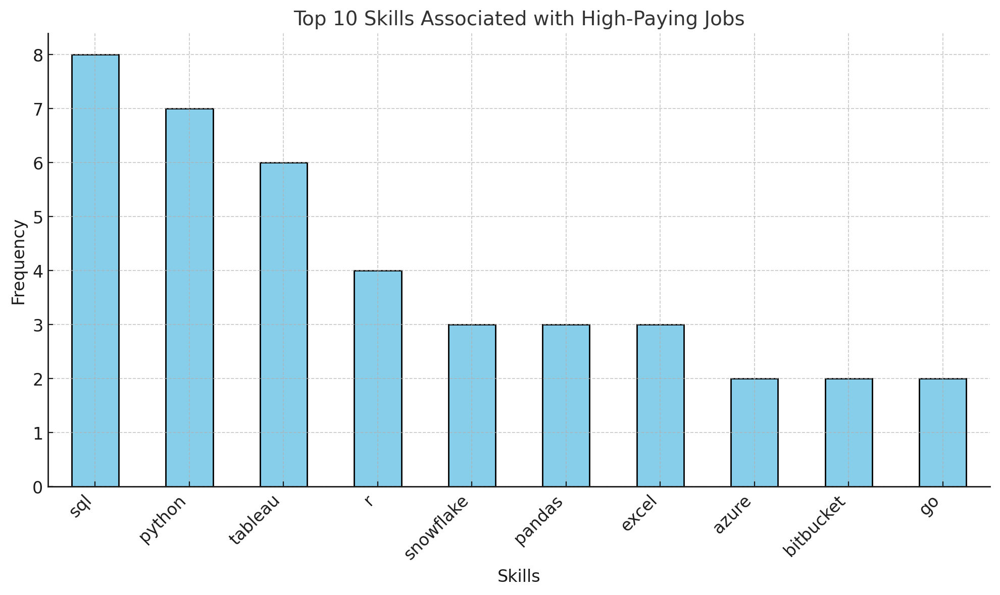
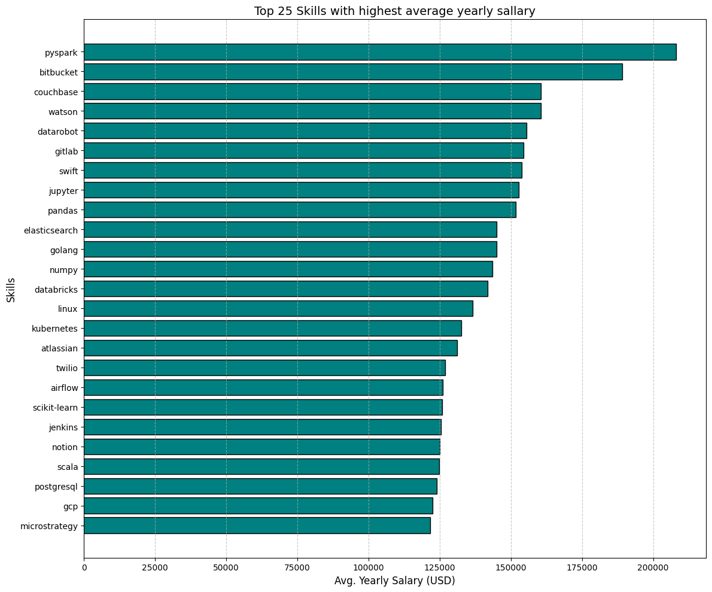

# Introduction

I am curious about Data Analyst and start to dig more information on the internet then find Luke Barousse YouTube channel and started to learn about SQL.

In this project, Luke guide me to dive into the Job Market data. With focusing on Data Analyst, we explore Top Paying Jobs 💰, Most Demanded Skills 🔎, and where high demands meets high salary 📈 in Data Analytics.

For the detail of SQL Queries, you can check out on [project_sql folder](/project_sql/)

# Background

Driven by a quest to navigate the data analyst job market more effectively, this project was born from a desire to pinpoint top-paid and in-demand skills, streamlining others work to find optimal jobs.

Data hails from SQL Course by [Luke Barousse](https://lukebarousse.com/sql). It's paked with insights on job titles, salaries, locations, and essential skills.

### The questions we have to answer through the SQL queries were:

1. What are the top-paying data analyst jobs?
2. What skills are required for these top-paying jobs?
3. What skills are most in demand for data analysts?
4. Which skills are associated with higher salaries?
5. What are the most optimal skills to learn?

# Tools I Used

To dive into Data Analyst Job Market, I use several tools:

- **SQL:** to query the database and uncover some relevant insight.
- **PostgreSQL:** Database management system to handle the job posting data
- **Visual Studio Code:** Code Editor to execute the queries
- **Git and GitHub:** for version control and sharing option to ensure tracking and collaboration

# The Analysis

### 1. What are the top-paying data analyst jobs?

Showing up the highest paying jobs available for the Data Analyst role, starting by sorting jobs by the highest average yearly salary with the role of Data Analyst and that available fot remote working.

```sql
SELECT
    job_id,
    job_title,
    job_location,
    job_schedule_type,
    salary_year_avg,
    job_posted_date,
    name AS company_name
FROM
    job_postings_fact
LEFT JOIN
    company_dim ON job_postings_fact.company_id = company_dim.company_id
WHERE
    job_title_short = 'Data Analyst'
    AND job_location = 'Anywhere'
    AND salary_year_avg IS NOT NULL
ORDER BY salary_year_avg DESC
LIMIT 10
```

### 2. What skills are required for these top-paying jobs?

The analysis shows the skills most frequently associated with high-paying jobs are as follows:



- SQL: Appeared 8 times.
- Python: Appeared 7 times.
- Tableau: Appeared 6 times.
- R: Appeared 4 times.
- Snowflake, Pandas, Excel: Appeared 3 times each.
- Azure, Bitbucket, Go: Appeared 2 times each.

```sql
WITH top_paying_jobs AS (
    SELECT
        job_id,
        job_title,
        salary_year_avg,
        job_posted_date,
        name AS company_name
    FROM
        job_postings_fact
    LEFT JOIN
        company_dim ON job_postings_fact.company_id = company_dim.company_id
    WHERE
        job_title_short = 'Data Analyst' AND
        job_location = 'Anywhere' AND
        salary_year_avg IS NOT NULL
    ORDER BY
        salary_year_avg DESC
    LIMIT 10
)

SELECT
    top_paying_jobs.*,
    skills
FROM top_paying_jobs
INNER JOIN skills_job_dim ON top_paying_jobs.job_id = skills_job_dim.job_id
INNER JOIN skills_dim ON skills_job_dim.skill_id = skills_dim.skill_id
ORDER BY
    salary_year_avg DESC
```

### 3. What skills are most in demand for data analysts?

```sql
/* count jobs based on skill */
SELECT
    skills,
    COUNT (job_title) AS total_jobs
FROM
    job_postings_fact
INNER JOIN skills_job_dim ON job_postings_fact.job_id = skills_job_dim.job_id
INNER JOIN skills_dim ON skills_job_dim.skill_id = skills_dim.skill_id
WHERE
    job_title_short = 'Data Analyst' AND
    job_location = 'Anywhere'
GROUP BY
    (skills)
ORDER BY
    total_jobs DESC
LIMIT 5
```

### 4. Which skills are associated with higher salaries?



- Top Salary Trends: Companies value skills that combine Big Data, cloud computing, and machine learning.
- Multidisciplinary: Programming, data engineering, and DevOps infrastructure skills are key to high-paying positions.
- Career Future: Mastering tools like PySpark, Databricks, and Kubernetes can be the best skill investment for high-paying positions in data science and analytics.

```sql
SELECT
    skills,
    ROUND(AVG (salary_year_avg),0) AS average_salary
FROM
    job_postings_fact
INNER JOIN skills_job_dim ON job_postings_fact.job_id = skills_job_dim.job_id
INNER JOIN skills_dim ON skills_job_dim.skill_id = skills_dim.skill_id
WHERE
    job_title_short = 'Data Analyst'
    AND salary_year_avg IS NOT NULL
    AND job_work_from_home = TRUE
GROUP BY
    skills
ORDER BY
    average_salary DESC
LIMIT 25

```

### 5. What are the most optimal skills to learn?

```sql
SELECT
    skills_dim.skill_id,
    skills_dim.skills,
    COUNT(skills_dim.skill_id) AS demanded_skills,
    ROUND(AVG(job_postings_fact.salary_year_avg),0) AS average_salary
FROM
    job_postings_fact
INNER JOIN skills_job_dim ON job_postings_fact.job_id = skills_job_dim.job_id
INNER JOIN skills_dim ON skills_job_dim.skill_id = skills_dim.skill_id
WHERE
    job_title_short = 'Data Analyst'
    AND salary_year_avg IS NOT NULL
    AND job_work_from_home = TRUE
GROUP BY
    skills_dim.skill_id
HAVING
    COUNT(skills_dim.skill_id)  > 10
ORDER BY
    average_salary DESC
LIMIT 25
```

# What I Learned

Throughout this adventure, I've turbocharged my SQL toolkit with some serious firepower:

- **🧩 Complex Query Crafting:** Mastered the art of advanced SQL, merging tables like a pro and wielding WITH clauses for ninja-level temp table maneuvers.
- **📊 Data Aggregation:** Got cozy with GROUP BY and turned aggregate functions like COUNT() and AVG() into my data-summarizing sidekicks.
- **💡 Analytical Wizardry:** Leveled up my real-world puzzle-solving skills, turning questions into actionable, insightful SQL queries.

# Conclusions

### Insights

From the analysis, several general insights emerged:

1. **Top-Paying Data Analyst Jobs:** The highest-paying jobs for data analysts that allow remote work offer a wide range of salaries, the highest at $650,000!
2. **Skills for Top-Paying Jobs:** High-paying data analyst jobs require advanced proficiency in SQL, suggesting it’s a critical skill for earning a top salary.
3. **Most In-Demand Skills:** SQL is also the most demanded skill in the data analyst job market, thus making it essential for job seekers.
4. **Skills with Higher Salaries:** Specialized skills, such as SVN and Solidity, are associated with the highest average salaries, indicating a premium on niche expertise.
5. **Optimal Skills for Job Market Value:** SQL leads in demand and offers for a high average salary, positioning it as one of the most optimal skills for data analysts to learn to maximize their market value.

### Closing Thoughts

This project enhanced my SQL skills and provided valuable insights into the data analyst job market. The findings from the analysis serve as a guide to prioritizing skill development and job search efforts. Aspiring data analysts can better position themselves in a competitive job market by focusing on high-demand, high-salary skills. This exploration highlights the importance of continuous learning and adaptation to emerging trends in the field of data analytics.
